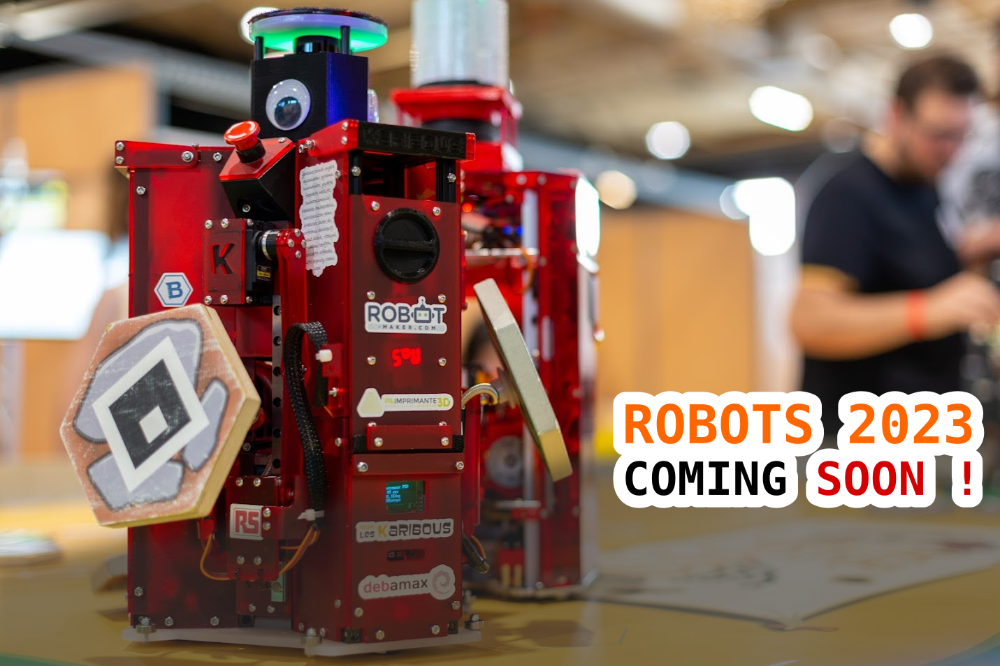

# Karibous 2023 - Hardware
Hardware du robot des Karibous pour la Coupe de Robotique (Eurobot) 2023.

Les Karibous, c'est une équipe de robotique fondée en 2011 avec la ferme intention de montrer que la robotique peut être simple et fun à réaliser. Depuis cette époque, elle participe chaque année à La Coupe de France de Robotique organisée par l'association [Planète Science](https://www.planete-sciences.org/national/) ainsi qu'à la MakerFight !

Chaque semaine, suivez l'évolution de nos robots en live twitch sur [Barbatronic Live](https://www.twitch.tv/barbatroniclive) ! 
- Plus d'informations sur la Coupe de France de robotique : [coupederobotique.fr](https://www.coupederobotique.fr/)
- Plus d'informations sur la Makerfight : [MakerFight](https://www.makerfight.fr/)
- Plus d'informations sur notre équipe : [Les Karibous](http://www.leskaribous.fr)

Pour la réalisation de nos robots, nous utilisons les logiciels suivants :
- [FreeCAD](https://www.freecadweb.org/index.php?lang=fr) : Logiciel de CAO. **Attention**, nous utilisons la version [FreeCAD by RealThunder](https://github.com/realthunder/FreeCAD/releases)
- [KiCAD](https://www.kicad.org/) : Editeur de PCB
- [InkScape](https://inkscape.org/fr/) : Logiciel de déssin vectoriel
- [PlatformIO](https://platformio.org/) : Ecosystème open source dédié au développement IoT.

Ils sont libres, OpenSources et gratuits, n'hésitez pas à les utiliser ;)

